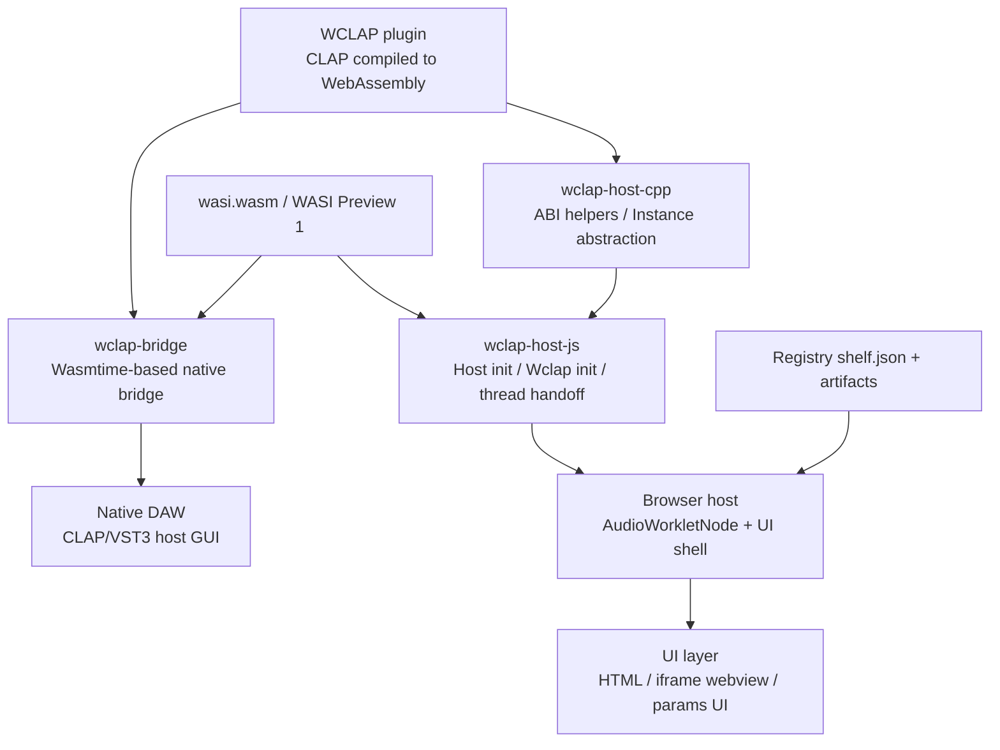

# WebCLAPとGUI実装の調査報告

## エグゼクティブサマリ

WebCLAPは、CLAPプラグインをWebAssembly化してブラウザやネイティブ環境で動かすための取り組みであり、公式GitHub組織では「移植性」「サンドボックス実行」「既存標準への準拠」を主目標として掲げています。技術的には、WCLAPは **CLAP + WebAssembly + 必要に応じてWASI** という構成で定義され、`clap_entry` のエクスポート、メモリ規約、関数テーブル、`malloc()` あるいは `cabi_realloc()` の提供などが実質的な互換条件になっています。citeturn19search1turn20search11turn32view0turn20search5

GUI実装の「公式本流」は二系統あります。ブラウザ側は `browser-test-host` と `wclap-host-js` を中心にした **AudioWorklet ベースのWebホスト系**、ネイティブ側は `wclap-bridge` を中心にした **Wasmtime ベースのブリッジ系** です。前者は WCLAP を `AudioNode` として扱う簡素なサンプルホスト、後者は WCLAP をネイティブ DAW に CLAP/VST3 経由で見せる実装で、draft webview extension を `clap.gui` に橋渡しする設計が明記されています。citeturn33view0turn39view0turn17view5turn17view4

`plinken.org` は、WebCLAP 公式ではないものの、現時点で最も「実運用に近い」ブラウザ GUI の一つです。ランディングサイトは SvelteKit 5 / TypeScript / Vite / Cloudflare Workers で作られ、公開レジストリ `shelf.json` を前提にしたカタログ UI を持ちます。とくに `apps/wclap-host` の現行コードは、README が説明する初期PoCより進んでおり、**単一 AudioWorkletNode に複数プラグインを直列実行する 5 スロット・ラック、トーン/マイク切替、MIDIバー、plugin iframe panel、compact UI、auto-generated fader UI、state save/load、bypass、レイテンシ表示** を備える方向に発展しています。README 側はなお「GUI未対応・MIDI未対応・マルチチェイン未対応」と書いているため、**ドキュメントが実装に追いついていない** 状態とみるのが妥当です。citeturn9view1turn23view1turn37view3turn37view1turn38view0turn38view2turn14view2turn10view0

導入面で重要なのは、ブラウザ実装では **cross-origin isolation** が事実上の前提になることです。`wclap-host-js` は `SharedArrayBuffer` をスレッド対応で使うため、COOP/COEP と artifact 側の CORP/CORS を揃える必要があります。`plinken.org` は Cloudflare Worker と `_headers`、開発用 Vite 設定、`/r2-proxy` を使ってここをかなり丁寧に埋めています。逆に言うと、今後 GUI を新規に作るなら、音声処理よりもまず **ヘッダ設計・配布形式・レジストリ設計・UI/iframe ブリッジ** を最初からアーキテクチャに組み込むのが成功条件です。citeturn10view0turn25view0turn25view6turn25view7turn29view1turn30view0turn21search0turn21search4

## 概要と目的

WebCLAP の公式説明では、WCLAP は「CLAP モジュールを WebAssembly モジュールへコンパイルしたもの」と整理されており、組織としての主目的は **ポータブルな音声プラグイン**、**サンドボックス化された安全な実行**、**既存標準に基づく将来互換性** の三つです。CLAP 自体も、DAW とプラグイン間の安定 ABI を与えるオープン仕様として設計されているため、WebCLAP は CLAP を捨てて新しいWeb専用形式を作るのではなく、**CLAP の ABI と拡張モデルをそのまま WebAssembly 実行環境に運ぶ** 立場を取っています。citeturn19search1turn20search11turn20search8turn20search12

公式組織ページの technical description によれば、WCLAP は最低限として `clap_entry` をエクスポートし、メモリは共有インポートまたはエクスポートで扱い、単一の growable function table を持ち、ホストが自前構造体を置けるよう `malloc()` 互換を提供する必要があります。加えて、プラグインは WASI を必要に応じて利用でき、bundle 形式では `module.wasm` を含むディレクトリまたは `.tar.gz` として配布される想定です。HTTP 配布では bare module は `.wasm`、bundle は `.tar.gz` または `.wclap.tar.gz` を推奨しており、配布形態まで含めて実装ルールがかなり具体化されています。citeturn20search11turn32view0

GUI については、公式組織ページが **CLAP v1.2.7 の draft webview extension** を「WCLAP の主要なUI手段」と位置づけています。理由は単純で、ネイティブ CLAP GUI が要求する OS 依存の view handle をブラウザや WebAssembly サンドボックスに持ち込みにくいからです。そのため WCLAP では、HTML/JS ベースの webview UI を返し、必要なら `clap.gui` の `CLAP_WINDOW_API_WEBVIEW` も併用する、という整理になっています。これは後段で見る `wclap-bridge` の「webview draft extension を `clap.gui` に翻訳する」設計や、`plinken` 側の iframe パネル実装とも整合しています。citeturn32view0turn17view4turn13view1

一次情報を優先して調べた限りでは、WebCLAP には CLAP のような単独の大きな仕様書サイトではなく、**GitHub Organizations ページ + 各リポジトリ README + 実装コード** が事実上の仕様源になっています。日本語の公式資料は本調査範囲では確認しづらく、日本語で見つかったものはコミュニティ記事や周辺技術解説が中心でした。たとえば 2026 年の Zenn 記事では、WebCLAP をサポートするために AudioWorklet 前提の設計が必要になる点が触れられています。citeturn19search1turn35search7

## 技術仕様とアーキテクチャ

WebCLAP のコアアーキテクチャは、大きく分けると **WCLAP 本体のABI層**、**ホスト実装層**、**実行環境層** の三層です。ABI 層では `wclap-host-cpp` が C++ の型・ヘルパー群を提供し、`Pointer<>` / `Function<>` ラッパにより WASM メモリ上の CLAP 構造体を安全に扱えるようにしています。README は、WCLAP 側のポインタや関数ポインタがホストのネイティブ空間とは等価でないことを明確に説明しており、`Instance` 抽象と `IndexLookup<T>` のような補助でこの差を吸収する設計です。citeturn18view0turn17view6

ブラウザ実装層では `wclap-host-js` が中核です。このライブラリは、**C++ で書いた小さなホスト WASM を JS から起動し、その上に WCLAP をさらに読み込む二段構成** を前提にしています。トップレベル API は `getHost()` / `getWclap()` / `startHost()` / `runThread()` で、`Host` オブジェクトは `.startWclap()`、`.getWorkerData()`、`.shared`、`.initObj()` を提供します。README が `AudioWorklet` のような制限の強い環境でも `threadData` を worker 側へ渡せることを説明しており、**音声スレッドとJS制御スレッドを分離しながらスレッド対応のWCLAPを動かすための基盤** になっています。citeturn39view0

公式サンプルの `browser-test-host` は、この `wclap-host-js` を `AudioWorkletProcessor` ベースの `AudioNode` ラッパに載せた実例です。README は「単一 WCLAP を `AudioNode` として読み込む」こと、C++ 側の `wclap-js-instance` が CLAP 固有構造体を native-like 側へ閉じ込めること、そして `wasi_snapshot_preview1` を補助する WASI helper も含まれることを説明しています。つまり公式ブラウザ側の基本戦略は、**JS が直接 CLAP ABI を触らず、C++ WASM ホストを介して扱う** ことです。これは GC や型の揺らぎを避け、RT 系コードを AudioWorklet 内へ押し込める意味でも合理的です。citeturn33view0turn21search0

ネイティブ実装層では `wclap-bridge` が対極にあります。README によると、このリポジトリは **WCLAP をロードしてネイティブ CLAP interface を提供する C API** と、**WCLAP をネイティブ DAW に見せる CLAP/VST3 bridge plugin** の二つを提供します。実行エンジンは Wasmtime の C API で、C API 自体は 10 関数に絞られています。さらに limitation と validity checking の節では、ポインタの無変換通過を避けること、非ドラフト拡張のかなり広い範囲をサポートすること、webview draft extension を `clap.gui` へ翻訳すること、WCLAP がスレッド未対応なら main thread 使用で audio thread block の可能性があることが明記されています。セキュリティと安全性を最も強く意識した実装は、現状ではこのブリッジ系です。citeturn17view5turn17view4

WASI については、WebCLAP 全体が `wasi_snapshot_preview1` を事実上の現行ベースラインとして扱っています。組織ページは Preview 1 が広く使われていると説明し、`wasi.wasm` は JS 環境向けに stdout/stderr と in-memory VFS を備えた WASI 実装を提供します。README には `getWasi()` / `startWasi()`、`bindToOtherMemory()`、`copyForRebinding()` などの API があり、cross-origin isolated な場合に shared memory で WASI 状態を Worker/Worklet 間共有できるとあります。したがって WebCLAP における WASI は「execve 的なOS層」ではなく、**ファイル・ログ・乱数・簡易VFS を横断的に与える実務的ランタイム層** と考えるのが実態に近いです。citeturn32view0turn18view1turn20search1turn20search5

セキュリティ面では、WebCLAP の「サンドボックス実行」という理念に加えて、ブラウザホストでは **COOP/COEP/CORP/CORS** が実装要件になります。`plinken` の `wclap-host` README と Vite 設定は `Cross-Origin-Opener-Policy: same-origin` と `Cross-Origin-Embedder-Policy: require-corp` を明示し、Worker 側では same-origin な assets 応答に COOP/COEP を付与し、`/r2-proxy` では upstream artifact に `Access-Control-Allow-Origin: *` と `Cross-Origin-Resource-Policy: cross-origin` を付けています。さらに site 側 `_headers` と REGISTRY.md は `shelf.json` と artifact に対して A-C-A-O と CORP を必須とし、HTTPS と適正 Content-Type まで要求しています。つまりブラウザ上の WebCLAP は、プラグイン ABI 以上に **配布・配信・ヘッダ** が成功可否を左右します。citeturn10view0turn25view0turn25view6turn25view7turn29view1turn30view0turn21search4

以下は、公式系構成と `plinken` 実装を合わせて要約したアーキテクチャ図です。図の各要素は `browser-test-host` README、`wclap-host-js` README、`plinken` README/コードに基づいています。citeturn33view0turn39view0turn10view0turn37view3

## GUI版の現状

### 公式実装と非公式実装の整理

公式 GitHub 組織において、GUI を伴う実装として最重要なのは `browser-test-host`、`wclap-bridge`、そしてそれらの基盤である `wclap-host-js` です。組織ページでは `browser-test-host` が「Browser-based host for WCLAP plugins」、`wclap-host-js` が「JS / C++ library for managing WCLAPs in the browser」、`wclap-bridge` がネイティブDAW向けブリッジとして説明されています。更新日は 2026 年 1 月末に集中しており、少なくとも 2026 年前半時点では全体が死蔵ではなく継続更新されていると見てよいです。citeturn32view0turn31view0turn31view2

公式ブラウザGUIの中心 `browser-test-host` は、README ベースでは **URL パラメータで任意の CORS 可な WCLAP を指定できる簡素なデモホスト** です。デフォルトでは Signalsmith Basics の WASM build を読み込み、minimal examples に含まれる webview UI つきプラグインも動作例として示しています。表示上の公開デモページは非常にミニマルで、取得できた描画テキストからも「parameters UI」「AudioContext paused」程度しか見えず、プロダクト級UIではなく **技術実証のサンプル** という位置づけが妥当です。citeturn33view0turn33view1

公式ネイティブGUIの中心 `wclap-bridge` は、ブラウザではなく DAW 上の UI 連携が対象です。とはいえ WebCLAP の GUI 戦略を理解する上では重要で、README は webview draft extension を `clap.gui` に変換して既存 DAW に載せることを limitation 節で明言しています。つまり「WCLAP の GUI をネイティブホスト側に届ける」実装が公式に存在しており、**WebCLAP の GUI はブラウザ専用でなく、webview を共通UI搬送路にしている** と理解できます。citeturn17view4turn17view5

非公式側で最も注目に値するのが `taluvi-dev/plinken-org` です。ランディングページ `plinken.org` は「community side of Plinken」として、公開レジストリ、ブラウザホスト、参照プラグイン群をひとつの体験にまとめています。さらに `build-shelf.mjs` と `REGISTRY.md` により、`shelf.json` を公開し、それを任意ホストが利用できるようにする実装まで揃えています。これは単なるホストの見た目以上に、**GUI + カタログ + 配布** を一体化した実践例です。citeturn9view1turn28view5turn29view1

WebCLAP 非公式・周辺系としては `atsushieno/uapmd` も押さえておく価値があります。これは VST3/AU/LV2/CLAP/AAP/WebCLAP を横断するホストエンジンですが、README は Web(Emscripten) を対象 platform に含め、`uapmd-app` がプラグインを列挙・インスタンス化・GUI起動・state保存復元まで扱えると説明しています。WebCLAP 専用GUIではないものの、**WebCLAP を組み込んだ実アプリケーション系GUI** としてはかなり先行しています。citeturn36view0

### plinken.org の UI 設計と実装

`plinken.org` のトップページは `apps/site` 配下の SvelteKit アプリで、`package.json` によれば SvelteKit 2、Svelte 5、TypeScript、Vite、Cloudflare adapter、Wrangler を採用しています。ソース `+page.svelte` は、トップで “OPEN WCLAP HOST & PLUGINS” を掲げ、**HOST / PLUGINS / REGISTRY / OPEN** の四枚カードで情報を整理し、STACK として `SvelteKit 5`, `TypeScript`, `Vite`, `wasm32`, `WebAudio`, `AudioWorklet`, `Cloudflare Workers`, `WebCLAP`, `wclap-host-js`, `wclap-bridge` をそのまま開示しています。ランディングページとしては、導入説明・ビルド技術・試用導線・レジストリエンドポイントを一画面に収める設計です。citeturn9view0turn9view1

デザイン面では、`app.css` から **dark theme 固定のカラースキーム**、plinken.com ブランドパレット、lavender / periwinkle / purple / teal をアクセントにした配色、display 用に `Unbounded` を含むフォントスタック、body 背景に複数の radial-gradient を重ねた視覚演出が確認できます。装飾は強いものの、構成自体はかなりテキスト主体で、プロダクトサイトというより **技術プロジェクトのLP** として設計されている印象です。citeturn12view4turn9view2

このトップページで最も重要なのは、UI が単なる宣伝ではなく **`shelf.json` と `/wclap/<plugin-id>...` を直接見せるドキュメントUI** になっている点です。`+page.svelte` は REGISTRY セクションで `GET plinken.org/shelf.json` と artifact パスを明示し、`curl ... | jq '.items[].id'` のスニペットまで書いています。つまり UI 設計思想として、ユーザー向けサイトと開発者向け API ドキュメントの境界をかなり薄くしています。citeturn12view3

一方で、実際に音を出すホスト UI は `apps/wclap-host` 側にあり、ここが `plinken.org` 研究対象として最も重要です。`index.html` は hero 部で “Load a WCLAP plugin.” と説明し、Source セクションに Tone / Mic のスイッチ、デバイス選択、L/R/Mono/Stereo のマイクチャンネル選択、MIDI in バー、5 スロットの rack、shelf、URL 追加バー、status grid、L/R メーターを配置しています。ARIA 的にも `role="switch"`、`role="radiogroup"`、`aria-live="polite"` が入っており、少なくとも基本アクセシビリティは意識されています。citeturn23view2turn23view1

実装コードを見ると、`src/main.ts` 冒頭コメントがこの UI の責務を非常に明快に説明しています。そこでは **AudioContext + base graph、1 個の chain AudioWorkletNode、5-slot rack UI、plugin iframe panels via `/plugin-proxy/` service worker** が main thread orchestrator の責務とされ、`NUM_SLOTS = 5`、`sourceMode`、`micChannelMode`、`SHELF_DT_TYPE` などが状態の中心になります。ここから、現在の `plinken` host は「単一プラグイン PoC」ではなく、**固定長ラックと GUI 埋め込みを持つマルチプラグイン・ブラウザホスト** へ進化していることが分かります。citeturn37view3turn12view7turn13view9

さらに現行コードは、plugin ごとの `webviewUri` を `clap.webview/3` の `get_uri` 結果として保持し、これを **UI 有無の authoritative signal** と明記しています。ラック描画では UI がある slot に対して “strip” ボタンを、全 occupied slot に対して “auto” “save” “load” “bypass” ボタンを追加し、auto-generated fader UI や clipboard ベースの state save/load を提供しています。worklet からは `webview`、`params`、`state-saved`、`state-loaded`、`latency`、`crashed`、`error` といったメッセージが返る設計になっており、**制御プレーンがかなり豊富** です。citeturn13view1turn14view2turn38view0turn38view2turn37view0

重要な観察として、`apps/wclap-host/README.md` は依然として「v1 deliberately omits: Plugin GUIs, MIDI events, parameter automation, multi-plugin chains, state save/load」と記しています。しかし実コードと `index.html` は、少なくとも GUI パネル、5-slot chain、MIDI UI、state save/load を部分的に実装済みとして示しています。この乖離は、ドキュメント保守の遅れ、あるいは README が過去リリース前提の説明のまま残っていることを意味しています。導入時には **README よりソースコードを優先** すべきです。citeturn10view0turn23view1turn37view3turn38view0turn38view2

### GUI実装の比較

下表は、主要な GUI 実装を「公式」「非公式」「実行環境」「GUI方式」「導入難易度」「メンテ状況」で比較したものです。導入難易度は、依存関係・ビルド手順・実行前提からの分析的推定です。citeturn33view0turn39view0turn17view5turn9view0turn26view0turn36view0

| 実装 | 区分 | GUI方式 | 対応プラットフォーム | 主な機能 | 導入難易度 | メンテ状況 | ライセンス |
|---|---|---|---|---|---|---|---|
| `WebCLAP/browser-test-host` | 公式 | 単体 AudioNode ベースのブラウザUI。minimal examples の webview UI 動作例あり。citeturn33view0 | ブラウザ。公開デモあり。citeturn33view0turn33view1 | `?module=` で WCLAP 指定、CORS 可 artifact 読込、parameters UI、webview example。citeturn33view0turn33view1 | 中。ブラウザ配信と CORS artifact が必要。C++/JS 混成の理解も要る。citeturn33view0turn39view0 | 2026-01-29 更新。サンプル/PoC 色が強い。citeturn32view0 | 未指定（GitHub 表示上で明示確認できず）。citeturn33view0 |
| `taluvi-dev/plinken-org/apps/wclap-host` | 非公式 | 5-slot rack、iframe plugin panel、compact strip、auto fader UI、status/meter UI。citeturn37view3turn37view1turn38view0turn23view1 | Chromium 系推奨、Firefox 可、Safari best-effort。Cloudflare Workers で公開想定。citeturn10view0turn25view3 | トーン/マイク、MIDI bar、URL 追加、registry shelf、state save/load、bypass、latency、single-chain low latency。citeturn23view1turn23view2turn14view2turn38view0turn38view2turn37view0 | 中。`pnpm`、submodule、Cloudflare/Wrangler、COOP/COEP/CORP 理解が要る。citeturn10view0turn26view0turn25view0turn25view3 | 継続更新中。2026-05 時点の設計文書・設定が存在。実装は README より先行。citeturn10view1turn25view3turn10view0 | 未指定（この調査で明示確認できず）。citeturn26view0 |
| `WebCLAP/wclap-bridge` | 公式 | webview draft extension を `clap.gui` に翻訳し、ネイティブ DAW GUI と接続。citeturn17view4 | macOS で実地検証、Windows/Linux も build 可。ネイティブ DAW 向け。citeturn17view5 | WCLAP をネイティブ CLAP/VST3 bridge plugin として提示、C API 10 関数、標準検索パス走査。citeturn17view5 | 高。Wasmtime/C API/CMake/ネイティブ plugin build が必要。citeturn17view5 | 2026-01-30 更新、releases あり。公式系では最も実務向け。citeturn32view0turn17view1 | BSL-1.0。citeturn17view1 |
| `atsushieno/uapmd` | 非公式・周辺 | デスクトップ/クロスプラットフォーム app GUI。plugin GUI launch、multitrack sequencer UI。citeturn36view0 | Linux/macOS/Windows/Android/iOS/Web(Emscripten)。citeturn36view0 | 列挙、インスタンス化、GUI 起動、state save/load、multitrack、WebCLAP 対応 platform を含む。citeturn36view0 | 高。大型 C++ プロジェクトで依存も多い。citeturn36view0 | 2026-04-26 に v0.4.0。活発。citeturn36view0 | MIT。citeturn36view0 |

比較すると、**最短で WebCLAP GUI を理解するには `browser-test-host`、実践的なブラウザ UX を見るには `plinken`、ネイティブ DAW 統合を見るには `wclap-bridge`** が最適です。`uapmd` は「WebCLAPだけを見る」というより、WebCLAP をより広いホスティング基盤の一部として扱う実践例として有用です。citeturn33view0turn17view5turn36view0turn9view1

## 導入手順と実装ガイド

`plinken-org` のローカル起動は、まず `wclap-host` がもっとも明確です。README は、monorepo root で `git submodule update --init --recursive`、`pnpm install`、`pnpm --filter @plinken/wclap-host dev` を実行する手順を示しています。`package.json` では `dev`/`build`/`deploy` の各スクリプトが `build-shelf.mjs` を先に実行したうえで Vite または Wrangler を呼ぶようになっており、**ホスト UI と registry artifact の同期生成が起動手順に組み込まれている** のが特徴です。citeturn10view0turn26view0turn28view0

ランディングサイト `apps/site` も同様に `build-shelf.mjs` を前段に持ちます。`package.json` では `dev`、`build`、`deploy` のたびに shelf を再生成しており、Wrangler + Cloudflare adapter を使ってデプロイする構成です。`wrangler.jsonc` からは `plinken.org` / `www.plinken.org` を custom domain で受け、`ASSETS` binding で静的成果物を配る構成が読み取れます。したがって、ローカル/本番で **registry と site の成果物差異を出さない** 方針が明確です。citeturn9view0turn25view5

`wclap-host` の本番デプロイは、README 上は `pnpm --filter @plinken/wclap-host build` と `deploy` だけですが、中身は Cloudflare Worker 配備です。`wrangler.jsonc` は Worker 名 `plinken-org-wclap-host`、asset directory `dist`、`run_worker_first: true`、route `wclap.plinken.org` を指定し、Worker 側 `index.js` は ASSETS から静的ファイルを返しつつ COOP/COEP を付与します。つまり「静的サイトをそのまま置く」のではなく、**cross-origin isolation header を付けるための薄い edge worker を必ず通す** 設計です。citeturn10view0turn25view3turn24view0

artifact 配布については `build-shelf.mjs` と `REGISTRY.md` が要です。`build-shelf.mjs` は、各 `plugin.json` を検査して artifact を **`apps/wclap-host/public/samples` と `apps/site/static/wclap` の両方にコピーし、それぞれ用の `shelf.json` を生成** します。コメントには、Cloudflare Workers 同一アカウント間では subrequest が使いづらいため build time duplication を選んだとあり、これは運用上かなり実践的です。manifest 側では `manifest_version`、`id`、`name`、`vendor`、`version`、`artifact`、`format` が必須で、`format` は `wasm` か `tar.gz`、`has_ui` は「fast hint」扱いです。citeturn28view0turn29view0turn29view1

よくある問題は、まず **クロスオリジン分離不足** です。`wclap-host-js` は cross-origin isolated でなくても非スレッド経路にフォールバックしますが、スレッド付き plugin や shared memory 共有の恩恵は失われます。`plinken` の Vite 設定、Worker、site `_headers`、REGISTRY.md は、`Cross-Origin-Opener-Policy: same-origin`、`Cross-Origin-Embedder-Policy: require-corp`、artifact の `Cross-Origin-Resource-Policy: cross-origin` と `Access-Control-Allow-Origin: *` を明示しており、ブラウザホストを自作するならこの4つを最初から揃えるべきです。citeturn10view0turn25view0turn25view6turn29view1turn30view0

次に多いのは **artifact 取得まわり** です。`wclap-host` は外部 URL 追加時に upstream へ `HEAD` で到達確認し、通れば `proxiedUrl()` 経由で shelf に加えます。Worker 側 `/r2-proxy` は `GET/HEAD` のみ許可し、`http(s)` 以外は 400 で拒否します。これは COEP 下でも外部 registry をある程度取り込める便利機能ですが、artifact 側が CORS/CORP を持たない場合に成立させるための救済策でもあります。自前実装では、ここを open proxy 化しないために allow-list や署名検証を追加するのが望ましいでしょう。前半はソース上の事実、後半はそれに基づく提案です。citeturn14view0turn25view7turn25view6

実装上の落とし穴として、開発サーバで `.tar.gz` に `Content-Encoding: gzip` が付くと bundle 読み込みの都合が悪くなるため、`vite.config.ts` には `.tar.gz` への `content-encoding` を落とす middleware が入っています。また main thread → AudioWorklet 間で `WebAssembly.Module` を structured clone しようとして Chrome に拒否されるケースを想定したエラーハンドリングもあり、**ブラウザ固有制約がかなり多い** ことが分かります。単に WebAssembly を読み込めば終わりではありません。citeturn25view2turn38view2

拡張ポイントとしては、`wclap-host-js` の `getHost()/startHost()/startWclap()/runThread()` によるホスト起動面、`plugin.json` / `shelf.json` による registry 面、`clap.webview/3` と `webviewUri` による GUI 面、そして `manifest.ui.compact_size` + `strip` ボタンや `auto` UI のような host-side UI 面があります。`plinken` はこの4面をすでに個別モジュールに分けているので、新規実装時にも **engine / registry / GUI transport / host shell** を疎結合にして始めるのが扱いやすいです。citeturn39view0turn29view1turn13view1turn37view1

## 開発者向け提案

GUI を新規に作る、あるいは既存 GUI を改善する前提で最も推奨しやすいアーキテクチャは、`plinken` の現行実装が向かっている **単一 AudioWorkletNode に複数プラグインを直列実行する chain 方式** です。`DESIGN.md` は、旧来の「1 plugin = 1 AudioWorkletNode」だと render quantum 分のレイテンシが plugin 数ぶん加算されると説明し、chain 方式ではそれを 1 回ぶんに抑えられると述べています。ブラウザの system baseline はある程度避けられない一方、host 側追加遅延は抑えられるので、**GUI 改良より先に chain 化** を検討する価値があります。citeturn10view1

技術スタックは、音声処理とUIを明確に分離するのがよいです。実績がある組み合わせは **C++/Rust の host wasm + TypeScript UI shell + AudioWorklet + Edge headers** で、公式では `wclap-host-js` が C++/JS 二段構成、`plinken` では SvelteKit 5 + TypeScript + Vite + Cloudflare Workers が採られています。フレームワーク自体は React でも SvelteKit でも構いませんが、音声処理や plugin lifecycle をフロントフレームワークの state 管理に深く埋め込まず、**MessagePort / initObj / iframe bridge を中心にした明示的プロトコル** へ寄せた方が長期的に安定します。citeturn39view0turn9view0turn37view0

UX 設計は、`plinken` が既に示しているいくつかの原則がそのまま有効です。具体的には、**入力ソースの状態を明示すること、COI 状態と AudioContext 状態を見せること、メーターを常時表示すること、plugin UI がない場合でも auto-generated parameter UI を用意すること、state の save/load をUIから直接触れること** です。WebCLAP は plugin 側実装差が大きいため、ホストが「プラグインにUIがなくても最低限使える」退避経路を持っているかどうかが、実用性を大きく左右します。citeturn23view1turn14view2turn38view0

アクセシビリティは、Web 実装である以上もっと強く押し出してよい領域です。`plinken` の `index.html` はすでに `role="switch"`、`role="radiogroup"`、`aria-live="polite"` を使っているので、この方向を徹底し、plugin iframe 側にもフォーカス管理・キーボードショートカット・サイズ変更・高コントラスト対応を要求するのが望ましいです。とくに plugin 自体の webview UI は host DOM の外に出がちなので、**escape でパネルを閉じる、最後に開いた panel を追跡する** といった host 側の補助は有効です。`main.ts` も Escape で直近 panel を閉じる処理を持っています。citeturn23view2turn13view3

国際化については、現行ソースはほぼ全面的に英語文字列埋め込みです。これは OSS では普通ですが、もし公開 registry と host を広く展開するなら、SvelteKit/TS 側は UI strings を message catalog 化し、plugin manifest 側も `label` / `description` / `hint` の多言語化フィールド拡張を検討すべきです。現行 `REGISTRY.md` にはその仕組みは未指定なので、ここは今後の拡張余地です。現行仕様が `label` / `description` / `hint` の単一文字列のみを定義していることからの提案です。citeturn29view1

テスト戦略は、少なくとも四層に分けるのがよいです。第一に `plugin.json` / `shelf.json` の schema/conformance test。第二に、artifact 配布ヘッダの integration test。第三に、AudioWorklet での load / process / state save/load / webview message routing の end-to-end test。第四に、スレッド有無と cross-origin isolation 有無の matrix test です。`plinken` と `WebCLAP` のソースは、ここで壊れやすい点をほぼ示しており、`shelf.json` の validation、structured clone 制約、thread fallback、CORP 必須、webview 有無判定などを個別にテスト観点へ落とし込めます。citeturn29view0turn29view1turn38view2turn25view0turn13view1

## 参考ソースと優先度

このテーマでは、情報の信頼度はかなりはっきり分かれます。もっとも優先すべきなのは **公式 GitHub 組織トップの technical description** と **各 repo の README / 実装コード** です。仕様の厳密さは CLAP/WASI/W3C に依存しつつも、WebCLAP 固有の実務ルールはここにしかまとまっていません。`browser-test-host` と `wclap-host-js` はブラウザ、`wclap-bridge` はネイティブ、`wclap-host-cpp` は ABI 補助、`wasi.wasm` はランタイム補助として読むのが効率的です。`plinken-org` は非公式ですが、GUI と配布の現実解として非常に価値が高いです。citeturn19search1turn33view0turn39view0turn17view5turn18view0turn18view1turn9view1

関連する Issue / PR 情報は、現時点ではそれほど豊富ではありません。少なくとも取得できた GitHub 画面では、`browser-test-host` は public issue / PR ともに 0、`wclap-host-js` も issue / PR ともに 0、`wclap-bridge` は少なくとも public PR 1 が見えます。したがって、現在は issue 議論を読むより **実装コードを追う方が情報密度が高い** 段階です。citeturn33view0turn39view0turn32view0

関連論文・標準の優先順位は次のように考えるのが妥当です。

| 優先度 | ソース | 用途 |
|---|---|---|
| 最優先 | `github.com/WebCLAP` 組織トップ technical description citeturn20search11turn32view0 | WCLAP の事実上の“仕様冒頭” |
| 最優先 | `browser-test-host` README / `wclap-host-js` README / `wclap-bridge` README citeturn33view0turn39view0turn17view5 | ブラウザGUI・ネイティブGUI・API の具体像 |
| 最優先 | `plinken-org` の `apps/site`, `apps/wclap-host`, `REGISTRY.md`, `build-shelf.mjs` citeturn9view1turn23view1turn29view1turn29view0 | 現実的な GUI/registry/deploy 実装 |
| 高 | CLAP 公式/参照実装 (`free-audio/clap`, `cleveraudio.org`) citeturn20search8turn20search12 | CLAP 側の ABI・feature tags・拡張理解 |
| 高 | W3C Web Audio API / AudioWorklet citeturn21search0turn21search2 | ブラウザ音声処理の土台 |
| 高 | WASI.dev / WebAssembly WASI repo citeturn20search1turn20search5 | WASI Preview 1 と将来互換性の前提 |
| 中 | `wasi.wasm` README citeturn18view1 | JS 環境での WASI 実装実務 |
| 中 | 日本語コミュニティ記事（例: Zenn） citeturn35search7 | 日本語文脈での補助理解 |
| 参考 | IRCAM / WAC 周辺発表 “WCLAP: Reusing the CLAP standard for Web Audio” citeturn19search6turn20search15 | 周辺研究・コミュニティ動向の把握 |

総合すると、現時点の WebCLAP は「正式標準書が完成したプラットフォーム」というより、**CLAP・WebAssembly・WASI・Web Audio という既存標準の交点に、GitHub 実装が実質仕様として立っている段階** です。その中で GUI 実装は、公式では `browser-test-host` と `wclap-bridge`、実践例としては `plinken` がもっとも研究価値の高い対象でした。未指定の点はなお多いものの、逆に言えば、今後 GUI を作る余地はまだ大きく残っています。citeturn19search1turn33view0turn17view5turn9view1